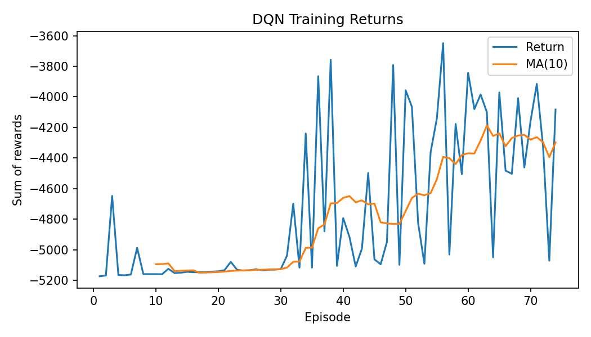

# Algorithms

## 1. Tabular Q-Learning

### 1.1 Overview

Q-learning is a model-free, off-policy reinforcement learning algorithm that learns an action-value function $Q(s, a)$ mapping state-action pairs to expected cumulative reward. It is "tabular" because $Q$ is stored as a lookup table (implemented as a `defaultdict`) rather than approximated by a neural network.

Tabular Q-learning is a natural first baseline for this problem because the discretized state and action spaces are small enough to enumerate, updates are simple and stable, and there are no neural-network hyperparameters to tune.

### 1.2 State Discretization

The continuous observation vector $\mathbf{s} \in [0, 1]^{2N}$ must be converted to a discrete key for table lookup. The `StateDiscretizer` partitions each dimension into $B$ bins using edge arrays and maps each continuous value to a bin index via `np.digitize`. The result is an integer tuple of length $2N$:

$$
\mathbf{s}_{\text{disc}} = \bigl(b_0,\; b_1,\; \dots,\; b_{2N-1}\bigr), \quad b_i \in \{0, \dots, B-1\}
$$

Two binning modes are available:

| Mode                | Dimensions         | Spacing                                             | Use case                            |
| ------------------- | ------------------ | --------------------------------------------------- | ----------------------------------- |
| Uniform (default)   | All                | Equal-width bins across $[0, 1]$                    | General purpose                     |
| Position heavy-tail | Position dims only | Quadratic spacing ($u^2$) concentrating bins near 0 | Higher resolution at small headways |

In the default training configuration, $B = 20$ bins per dimension are used for both velocity and position dimensions.

### 1.3 Update Rule

After each transition $(s, a, r, s')$, the Q-value is updated using the standard off-policy TD(0) rule:

$$
Q(s, a) \leftarrow (1 - \alpha)\,Q(s, a) + \alpha\,\bigl[r + \gamma \max_{a'} Q(s', a')\bigr]
$$

where:

- $\alpha$ is the learning rate controlling how much new information overrides the old estimate.
- $\gamma$ is the discount factor weighting future rewards.
- $\max_{a'} Q(s', a')$ is the best estimated value from the next state (set to 0 at terminal states).

This is equivalent to the more commonly written form:

$$
Q(s, a) \leftarrow Q(s, a) + \alpha\,\bigl[r + \gamma \max_{a'} Q(s', a') - Q(s, a)\bigr]
$$

### 1.4 Exploration Strategy

The agent uses an **$\varepsilon$-greedy** policy with **linear decay**:

$$
\varepsilon(t) = \varepsilon_{\text{start}} + \frac{t}{T_{\text{decay}}} \cdot (\varepsilon_{\text{end}} - \varepsilon_{\text{start}})
$$

where $t$ is the current step count and $T_{\text{decay}}$ is the total decay horizon. At each step:

- With probability $\varepsilon$, the agent selects a **random** action (exploration).
- With probability $1 - \varepsilon$, the agent selects $\arg\max_a Q(s, a)$ (exploitation), breaking ties randomly.

Epsilon starts at 1.0 (fully random) and decays linearly to 0.05 over the full training run, encouraging broad exploration early and convergence to the learned policy later.

### 1.5 Hyperparameters

| Parameter           | Symbol                       | Default                    |
| ------------------- | ---------------------------- | -------------------------- |
| Learning rate       | $\alpha$                     | 0.2                        |
| Discount factor     | $\gamma$                     | 0.98                       |
| Initial epsilon     | $\varepsilon_{\text{start}}$ | 1.0                        |
| Final epsilon       | $\varepsilon_{\text{end}}$   | 0.05                       |
| Epsilon decay steps | $T_{\text{decay}}$           | `num_episodes * max_steps` |
| Action bins         | $n$                          | 20                         |
| State bins per dim  | $B$                          | 20                         |
| Episodes            | —                            | 250                        |

### 1.6 Problems and Limitations

For this specific problem of controlling CAV, tabular Q-learning algorithm has several limitations:

1. **Scalability**: The state-action space grows exponentially with the number of vehicles and discretization bins, leading to a large Q-table that may not fit in memory or converge within a reasonable time.

2. **Generalization**: The agent cannot generalize to unseen states or actions, which may occur frequently in a continuous environment.

3. **Loss of precision from discretization**: The discretization process may lose important information about the state, especially if the bins are too coarse. This can lead to suboptimal policies.

Therefore, we concluded to use a **Deep Q-Network (DQN)** that can handle continuous state spaces and generalize better, while still being sample efficient and stable for training.

---

## 2. Deep Q-Network (DQN)

### 2.1 Overview

Deep Q-Networks (DQN) replace the Q-table with a neural network $Q_\theta(s, a)$ that maps continuous state vectors directly to action values. This addresses the key limitations of tabular Q-learning identified above: the network generalizes across similar states without requiring explicit discretization, and its parameter count is fixed regardless of the state space size.

The implementation uses **Double DQN** [[1]](#references) with a separate target network and experience replay buffer for stable training.

### 2.2 Network Architecture

The Q-network is a two-layer MLP that maps the observation vector to Q-values for each discrete action:

$$
\mathbf{s} \in \mathbb{R}^{2N} \xrightarrow{\text{Linear}(2N, 128)} \xrightarrow{\text{ReLU}} \xrightarrow{\text{Linear}(128, |\mathcal{A}|)} \mathbf{q} \in \mathbb{R}^{|\mathcal{A}|}
$$

| Layer | Input dim | Output dim                | Activation    |
| ----- | --------- | ------------------------- | ------------- |
| `fc1` | $2N$      | 128                       | ReLU          |
| `out` | 128       | $\lvert\mathcal{A}\rvert$ | None (linear) |

For the default 4-vehicle, 21-action configuration: input dim = 8, output dim = 21, total parameters $\approx$ 3,900.

### 2.3 Double DQN

Standard DQN uses the same network to both select and evaluate the next-state action, which leads to systematic overestimation of Q-values. **Double DQN** decouples these two steps:

1. The **online network** $Q_\theta$ selects the best next action:

$$
a^* = \arg\max_{a'} Q_\theta(s', a')
$$

2. The **target network** $Q_{\theta^-}$ evaluates that action:

$$
y = r + \gamma\,(1 - d)\,Q_{\theta^-}(s', a^*)
$$

where $d = 1$ if the episode terminated, $d = 0$ otherwise. This reduces overestimation bias by preventing the same network from both proposing and scoring the greedy action.

### 2.4 Experience Replay

Transitions $(s, a, r, s', d)$ are stored in a fixed-capacity **replay buffer** implemented as a `deque` with maximum size 200,000. When the buffer is full, the oldest transitions are discarded.

During each learning step, a **uniform random batch** of 128 transitions is sampled. This breaks temporal correlations between consecutive samples and allows each transition to be reused across multiple updates, improving sample efficiency.

Learning begins only after the buffer accumulates at least 10,000 transitions (`start_learning_after`), ensuring the initial batches are sufficiently diverse.

### 2.5 Target Network

A separate target network $Q_{\theta^-}$ provides stable regression targets during training. It is updated every 3,000 steps using **soft updates** (Polyak averaging):

$$
\theta^- \leftarrow (1 - \tau)\,\theta^- + \tau\,\theta
$$

with $\tau = 0.01$ by default. This gradually blends the online network's weights into the target, providing a smoother learning signal than periodic hard copies ($\tau = 1.0$).

When $\tau = 1.0$, the update becomes a **hard copy** of the online network weights.

### 2.6 Training Details

**Loss function**: Smooth L1 (Huber) loss between predicted and target Q-values:

$$
\mathcal{L} = \text{SmoothL1}\bigl(Q_\theta(s, a),\; y\bigr)
$$

Huber loss behaves as MSE for small errors and as MAE for large errors, making it more robust to outlier transitions than pure MSE.

**Optimizer**: Adam with learning rate $5 \times 10^{-4}$.

**Gradient clipping**: Gradients are clipped by global norm to 10.0 via `clip_grad_norm_` to prevent destabilizing parameter updates.

**Training loop**: The agent operates in a step-based loop (not episode-based). At each of the 350,000 total steps:

1. Select action via $\varepsilon$-greedy (same linear decay as Q-learning).
2. Execute action in SUMO, observe $(r, s', d)$.
3. Store the transition in the replay buffer.
4. If buffer size $\geq$ 10,000 and `steps % train_freq == 0`: sample a batch and perform one gradient step.
5. If `steps % target_update_freq == 0`: update the target network.
6. On episode termination, reset the environment and log the return.

### 2.7 Hyperparameters

| Parameter            | Symbol                       | Default            |
| -------------------- | ---------------------------- | ------------------ |
| Learning rate        | $\eta$                       | $5 \times 10^{-4}$ |
| Discount factor      | $\gamma$                     | 0.99               |
| Batch size           | —                            | 128                |
| Buffer size          | —                            | 200,000            |
| Start learning after | —                            | 10,000 steps       |
| Train frequency      | —                            | Every 1 step       |
| Target update freq   | —                            | Every 3,000 steps  |
| Soft update factor   | $\tau$                       | 0.01               |
| Initial epsilon      | $\varepsilon_{\text{start}}$ | 1.0                |
| Final epsilon        | $\varepsilon_{\text{end}}$   | 0.10               |
| Epsilon decay steps  | $T_{\text{decay}}$           | 500,000            |
| Max gradient norm    | —                            | 10.0               |
| Action bins          | $\lvert\mathcal{A}\rvert$    | 21                 |
| Total training steps | —                            | 350,000            |

### 2.8 Results

### 2.9 Problems and Limitations

Still, the action space is discretized, which may limit the optimality of the learned policy. The agent cannot output fine-grained accelerations, which may be necessary for smooth control in a continuous environment. As shown in the DQN performance plot, the agent learns a reasonable policy but displays some spikes in the velocity to catch up the head vehicle, which may not be ideal for smooth traffic flow. Therefore, we concluded to use a policy-gradient method that can directly output continuous actions, such as **Proximal Policy Optimization (PPO)**, which is more suitable for continuous control tasks and can learn more stable policies with fewer hyperparameters to tune.

## 3. Proximal Policy Optimization (PPO)

## References

[1] Mnih, V., Kavukcuoglu, K., Silver, D., Graves, A., Antonoglou, I., Wierstra, D., & Riedmiller, M. (2013). Playing Atari with Deep Reinforcement Learning. arXiv [Cs.LG]. Retrieved from http://arxiv.org/abs/1312.5602
