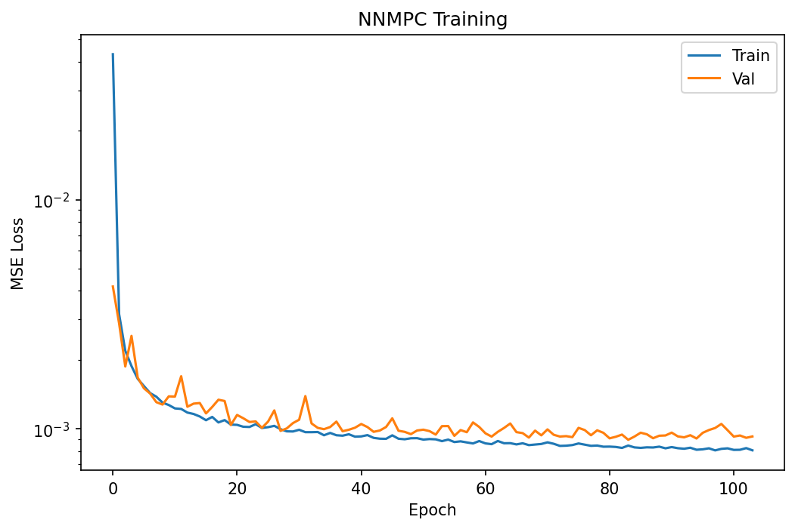
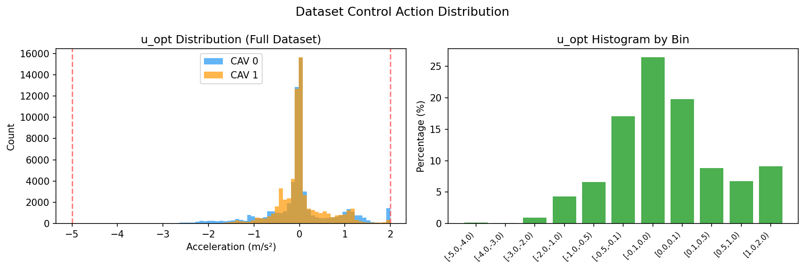
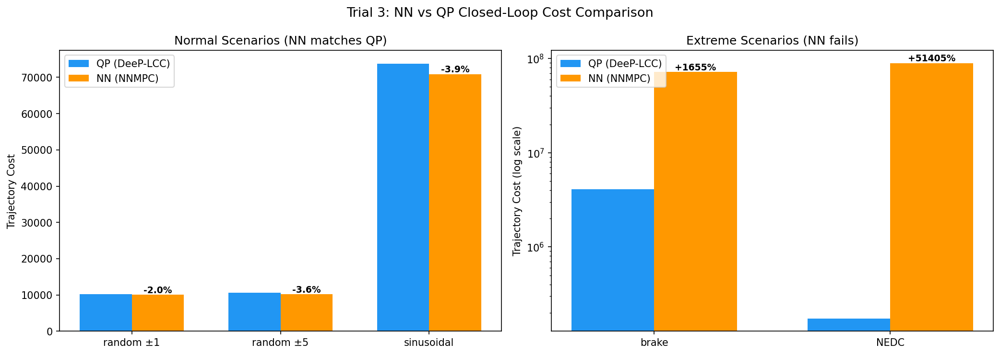
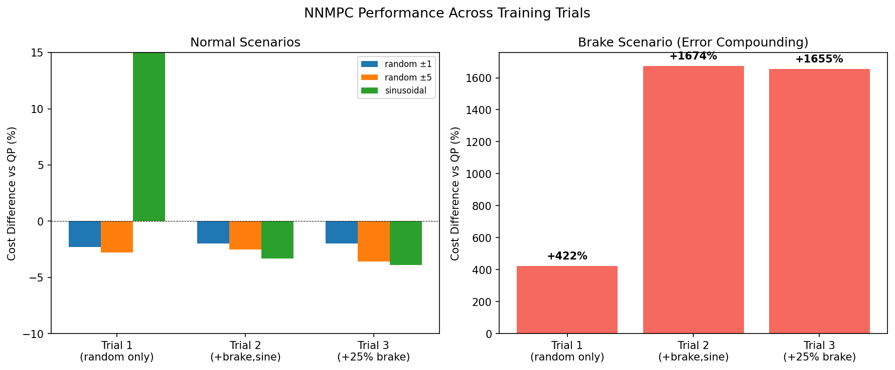

# DeeP-LCC Dataset Generation

## Overview

This module generates (state, solution) pair datasets for training an NNMPC (Neural Network Model Predictive Control) surrogate of DeeP-LCC, following the architecture in [arxiv:2510.03354](https://arxiv.org/abs/2510.03354).

The pipeline runs entirely in Python using OVM (Optimal Velocity Model) car-following dynamics — no SUMO dependency. It ports the [MATLAB DeeP-LCC implementation](https://github.com/soc-ucsd/DeeP-LCC) to produce datasets that can train a neural network to approximate DeeP-LCC's QP solver in real time.

## Background: DeeP-LCC

DeeP-LCC (Data-EnablEd Predictive Leading Cruise Control) is a data-driven predictive controller for connected autonomous vehicles (CAVs) in mixed traffic. Unlike model-based MPC, it uses pre-collected trajectory data organized into Hankel matrices to predict future system behavior without an explicit system model.

**Key reference:** Wang et al., "Data-Driven Predicted Control for Connected and Autonomous Vehicles in Mixed Traffic," IEEE Trans. Control Systems Technology, 2023.

### How It Works

1. **Pre-collection (offline):** Apply persistently exciting random inputs to the traffic system for `T` steps. Record control inputs `u`, external disturbances `e`, and measured outputs `y`. Build Hankel matrices from these trajectories.

2. **Online control:** At each time step, given the past `T_ini` steps of data `(uini, yini, eini)`, solve a QP to find optimal future control actions that minimize a cost function balancing velocity tracking, spacing regulation, and control effort.

3. **Receding horizon:** Only the first control action `u_opt[0]` is applied; then the process repeats.

### The Optimization Problem

```
minimize:  ||Yf·g||²_Q + ||Uf·g||²_R + λ_g·||g||² + λ_y·||Yp·g - yini||²

subject to:
  [Up]         [uini]
  [Ep] · g  =  [eini]     (consistency with past data)
  [Ef]         [  0 ]      (zero future disturbance assumption)

  dcel_max ≤ Uf·g ≤ acel_max        (acceleration bounds)
  s_min - s* ≤ Sf·Yf·g ≤ s_max - s* (spacing safety constraints)
```

Where `g` is the decision variable (Hankel combination weights) and `Uf·g` / `Yf·g` recover optimal future control and output trajectories.

## Vehicle Configuration

Matches the DeeP-LCC reference implementation exactly:

- **8 following vehicles:** `ID = [0, 0, 1, 0, 0, 1, 0, 0]`
  - 6 HDVs (human-driven, follow OVM model)
  - 2 CAVs at positions 3 and 6 (controlled by DeeP-LCC)
- **1 head vehicle** with externally perturbed velocity
- Total: 9 vehicles in a platoon

### OVM Parameters (Homogeneous, data_str=3)

| Parameter | Value | Description |
|-----------|-------|-------------|
| α (alpha) | 0.6 | Sensitivity to desired velocity |
| β (beta) | 0.9 | Sensitivity to relative velocity |
| v_max | 30 m/s | Maximum velocity |
| s_st | 5 m | Minimum stopping distance |
| s_go | 25 m | Free-flow spacing threshold |
| v* | 15 m/s | Equilibrium velocity |
| s* | 20 m | Desired equilibrium spacing |

**OVM dynamics:**
```
V_d(s) = v_max/2 · (1 - cos(π · (s - s_st) / (s_go - s_st)))
a = α · (V_d(s) - v_follower) + β · (v_leader - v_follower)
```

Acceleration is saturated to `[-5, 2]` m/s² with safety braking when deceleration demand exceeds the limit.

> **Note:** The OVM equilibrium spacing (where `V_d = v*`) is `s_eq = 15 m` for these parameters, computed as `acos(1 - 2·v*/v_max)/π · (s_go - s_st) + s_st`. The controller reference `s* = 20 m` is deliberately larger to maintain safe following distances.

## DeeP-LCC Parameters

| Parameter | Value | Description |
|-----------|-------|-------------|
| T | 2000 | Pre-collection trajectory length |
| T_ini | 20 | Past data horizon |
| N | 50 | Prediction horizon |
| Tstep | 0.05 s | Simulation time step |
| weight_v | 1.0 | Velocity error weight |
| weight_s | 0.5 | Spacing error weight |
| weight_u | 0.1 | Control effort weight |
| λ_g | 1.0 | Regularization on g |
| λ_y | 1000 | Output consistency regularization |
| acel_max | 2.0 m/s² | Maximum acceleration |
| dcel_max | -5.0 m/s² | Maximum deceleration |
| spacing_min | 5.0 m | Minimum safe spacing |
| spacing_max | 40.0 m | Maximum spacing |
| perturb_mix | [(1.0, 0.5), (3.0, 0.3), (5.0, 0.2)] | Mixed perturbation amplitudes |

### Perturbation Amplitude Mixing

To ensure the dataset covers the full operating range (not just near-equilibrium), the head vehicle perturbation amplitude varies across episodes:

| Amplitude | Fraction | Head velocity range | Purpose |
|-----------|----------|-------------------|---------|
| ±1 m/s | 50% | [14, 16] m/s | Near-equilibrium behavior |
| ±3 m/s | 30% | [12, 18] m/s | Moderate disturbances |
| ±5 m/s | 20% | [10, 20] m/s | Aggressive disturbances, constraint activation |

Episodes are assigned amplitudes in contiguous blocks. Configure via `DeepLCCConfig.perturb_mix`.

### Measurement Type

Uses `measure_type = 3`: velocity errors of all 8 vehicles + spacing errors of 2 CAVs only.

Output vector dimension: `p = n_vehicle + n_cav = 8 + 2 = 10`.

## Dataset Format

Saved as `.npz` with the following arrays:

| Key | Shape | Description |
|-----|-------|-------------|
| `uini` | `(N_samples, m_ctr × T_ini)` = `(N, 40)` | Past CAV accelerations (2 CAVs × 20 steps) |
| `yini` | `(N_samples, p × T_ini)` = `(N, 200)` | Past output measurements (10 outputs × 20 steps) |
| `eini` | `(N_samples, T_ini)` = `(N, 20)` | Past head vehicle velocity disturbance |
| `u_opt` | `(N_samples, m_ctr)` = `(N, 2)` | Optimal first control action (receding horizon) |
| `metadata` | `(6,)` | `[v_star, s_star, T_ini, N, lambda_g, lambda_y]` |

The NN input is `(uini, yini, eini)` concatenated (260 features); the label is `u_opt` (2 values).

## Pipeline Architecture

```
┌─────────────────────────────────────────────────────────────┐
│                   For each episode:                         │
│                                                             │
│  Phase 1: Pre-Collection (precollect.py)                    │
│  ┌───────────────────────────────────────────┐              │
│  │ OVM simulation with random PE inputs      │              │
│  │ for T=2000 steps                          │              │
│  │  → ud (CAV accels), ed (head perturb),    │              │
│  │    yd (measured outputs)                  │              │
│  │  → Build Hankel matrices                  │              │
│  │    (Up, Uf, Ep, Ef, Yp, Yf)              │              │
│  └───────────────────────────────────────────┘              │
│                        ↓                                    │
│  Phase 2: DeeP-LCC Closed Loop (generate_dataset.py)        │
│  ┌───────────────────────────────────────────┐              │
│  │ OVM simulation with DeeP-LCC controller   │              │
│  │  → At each step:                          │              │
│  │    1. Measure (y_k, e_k)                  │              │
│  │    2. Build state: (uini, yini, eini)     │              │
│  │    3. Solve QP → u_opt                    │              │
│  │    4. Record (state, u_opt[0:m]) pair     │              │
│  │    5. Apply u_opt[0:m] to CAVs            │              │
│  └───────────────────────────────────────────┘              │
│                        ↓                                    │
│  Save dataset.npz                                           │
└─────────────────────────────────────────────────────────────┘
```

## Usage

### Dataset Generation

```bash
# Generate dataset with default parameters (100 episodes, mixed perturbations)
uv run rl_mixed_traffic/deep_lcc/generate_dataset.py

# Output: deep_lcc_dataset/dataset.npz
```

### NNMPC Training

```bash
# Train NN to approximate the QP solver
uv run rl_mixed_traffic/deep_lcc/nnmpc_train.py

# Output: deep_lcc_results/nnmpc.pth, deep_lcc_results/nnmpc_training_loss.png
```

### NNMPC Evaluation

```bash
# Evaluate NN vs QP (offline accuracy + closed-loop simulation)
uv run rl_mixed_traffic/deep_lcc/nnmpc_eval.py
```

### Programmatic Usage

```python
from rl_mixed_traffic.deep_lcc.config import DeepLCCConfig, OVMConfig
from rl_mixed_traffic.deep_lcc.generate_dataset import generate_dataset

config = DeepLCCConfig(num_episodes=10)
ovm_config = OVMConfig()
dataset = generate_dataset(config, ovm_config, seed=42)

# dataset['uini'].shape  → (N_samples, 40)
# dataset['u_opt'].shape → (N_samples, 2)
```

## Module Structure

```
rl_mixed_traffic/deep_lcc/
├── config.py           # OVMConfig + DeepLCCConfig dataclasses
├── ovm.py              # OVM car-following dynamics
├── hankel.py           # Hankel matrix construction
├── measurement.py      # Output measurement function
├── qp_solver.py        # DeeP-LCC QP solver (cvxopt dense interior-point)
├── precollect.py       # Phase 1: trajectory pre-collection
├── generate_dataset.py # Dataset generation pipeline
├── nnmpc_config.py     # NNMPC training configuration
├── nnmpc_network.py    # NNMPC neural network (MLP)
├── nnmpc_train.py      # Supervised training script
└── nnmpc_eval.py       # Offline + closed-loop evaluation
```

## NNMPC Architecture

The NNMPC approximates the DeeP-LCC QP solver with a simple MLP, following the approach in [arxiv:2510.03354](https://arxiv.org/abs/2510.03354).

### Network

```
Input (260) → Linear(256) → ReLU → Linear(128) → ReLU → Linear(2) → Tanh → Scale to [-5, 2]
```

- **Input:** concatenated `(uini, yini, eini)` = 40 + 200 + 20 = 260 features
- **Output:** 2 CAV accelerations, bounded by Tanh + asymmetric scaling to [dcel_max, acel_max]
- **Parameters:** ~100k
- **Input normalization:** per-feature mean/std computed from training set, saved with checkpoint

### Training

- Supervised learning: MSE loss on `u_opt` predictions
- Adam optimizer (lr=5e-4, weight_decay=1e-5)
- Early stopping on validation loss (patience=20 epochs)
- Train/val split: 90/10

### Evaluation

Two modes:

1. **Offline accuracy:** MSE, MAE, max error on held-out validation data
2. **Closed-loop simulation:** run NN controller in the OVM simulation loop, compare trajectory cost against the QP controller on multiple scenarios

### Results

Three training configurations were tested to improve closed-loop robustness. All use the same 260-dim MLP (256→128→2) architecture.

#### Training Loss (Trial 3)



#### Dataset Control Action Distribution



#### Trial 1: Random-only training data

Training data: 100 episodes, 50% ±1 / 30% ±3 / 20% ±5 random perturbations.

**Offline:** MSE=0.000896, MAE=0.020, Max error=0.318

| Scenario | QP Cost | NN Cost | Diff % |
|----------|---------|---------|--------|
| random ±1 | 10,285 | 10,052 | **-2.3%** |
| random ±5 | 10,574 | 10,279 | **-2.8%** |
| brake | 4.1M | 21.4M | +422% |
| sinusoidal | 73,749 | 7.4M | +9,914% |
| NEDC | 173,754 | 5.7M | +3,160% |

**Finding:** Excellent on random (in-distribution). Catastrophic on structured scenarios (out-of-distribution).

#### Trial 2: Added brake + sinusoidal to training data

Training data: 100 episodes, 35% random±1 / 20% random±3 / 15% random±5 / 15% brake / 10% sine±5 / 5% sine±3.

**Offline:** MSE=0.004462, MAE=0.024, Max error=3.970

| Scenario | QP Cost | NN Cost | Diff % |
|----------|---------|---------|--------|
| random ±1 | 10,285 | 10,080 | **-2.0%** |
| random ±5 | 10,574 | 10,313 | **-2.5%** |
| brake | 4.1M | 72.5M | +1,674% |
| sinusoidal | 73,749 | 71,331 | **-3.3%** |
| NEDC | 173,754 | 80.1M | +46,000% |

**Finding:** Sinusoidal fixed (from +9,914% to -3.3%). Brake still fails despite being in training data.

#### Trial 3: Increased brake fraction

Training data: 100 episodes, 30% random±1 / 15% random±3 / 10% random±5 / 25% brake / 10% sine±5 / 10% sine±3.

**Offline:** MSE=0.009098, MAE=0.030, Max error=5.160

| Scenario | QP Cost | NN Cost | Diff % |
|----------|---------|---------|--------|
| random ±1 | 10,285 | 10,076 | **-2.0%** |
| random ±5 | 10,574 | 10,198 | **-3.6%** |
| brake | 4.1M | 71.8M | +1,655% |
| sinusoidal | 73,749 | 70,858 | **-3.9%** |
| NEDC | 173,754 | 89.5M | +51,405% |

**Finding:** More brake data does not help. The brake scenario is fundamentally hard for the NN due to error compounding at extreme states (see Limitations below).

#### Closed-Loop Cost Comparison (Trial 3)



#### Performance Progression Across Trials



### Limitations of NN Deep-LCC

1. **Error compounding in closed loop.** The brake scenario drives the head vehicle to 5 m/s (ed = -10, a 67% drop from v_star = 15). Even though the NN trains on this exact signal, small prediction errors at these extreme states push the closed-loop simulation onto a different trajectory than the QP would produce. These errors accumulate over the 5+ seconds the system spends far from equilibrium, causing divergence. More training data does not fix this — it is a structural limitation of open-loop supervised learning for closed-loop control.

2. **No future information.** The NN only sees 1 second of past data (T_ini = 20 steps at 0.05s). It has no lookahead — unlike the paper's NNMPC ([arxiv:2510.03354](https://arxiv.org/abs/2510.03354)) which includes 50 future reference trajectory steps as input. The DeeP-LCC QP also has no future disturbance knowledge (assumes `Ef @ g = 0`), but it is re-optimized from scratch every step and naturally reacts to new information. The NN cannot adapt the same way.

3. **Asymmetric output bounds.** The acceleration range [-5, 2] m/s² is asymmetric. During braking, the QP produces large negative accelerations near the -5 bound. The Tanh scaling maps [-1,1] to [-5,2], which compresses the deceleration range — small Tanh changes near -1 map to large acceleration changes near -5, making precise braking control harder for the NN.

4. **Offline MSE ≠ closed-loop performance.** Trial 3 has 10x higher MSE than Trial 1 (0.009 vs 0.0009) due to the harder brake samples, yet random/sinusoidal closed-loop performance is equally good. Conversely, even low MSE does not prevent brake failure. Offline metrics are unreliable predictors of closed-loop success.

### Conclusion

The NNMPC is a reliable base controller for **normal operating conditions** (random perturbations, sinusoidal disturbances) with cost within 4% of the QP solver. For **extreme scenarios** (emergency braking), the NN fails due to error compounding — this is the exact gap that the RLMPC residual correction architecture is designed to fill.

## Model Mismatch: OVM vs SUMO IDM

The dataset is generated using **OVM** dynamics, but the SUMO ring road uses **IDM** (`carFollowModel="IDM"` in `configs/ring/circle.rou.xml`). This creates a sim-to-sim gap when deploying the NNMPC surrogate in SUMO.

See [Model Mismatch Analysis](#model-mismatch-analysis) below for implications and mitigation strategies.

### Model Mismatch Analysis

**The problem:** DeeP-LCC's Hankel matrices encode the input-output behavior of the OVM traffic system. When the NNMPC surrogate (trained on OVM-derived solutions) is deployed in SUMO where HDVs follow IDM, the controller's predictions about how traffic will respond to CAV actions are wrong.

**OVM vs IDM key differences:**

| Aspect | OVM | IDM |
|--------|-----|-----|
| Desired velocity | Depends on spacing only: `V_d(s)` | Depends on velocity too: free-flow term `(v/v0)^δ` |
| Gap sensitivity | Cosine function of spacing | Inverse-square of desired gap |
| Relative velocity | Linear term `β·Δv` | Appears inside desired gap calculation |
| Stability | Can be unstable (string instability) | Generally more stable |

**Impact on the RL integration (arxiv:2510.03354):**

The paper proposes two architectures:

1. **Warm Start RL:** Initialize RL actor with NNMPC weights, then fine-tune with RL. The model mismatch means the warm start is suboptimal but the RL training will adapt to SUMO's actual dynamics. The warm start still provides a better initialization than random weights.

2. **RLMPC (residual correction):** RL generates additive corrections `δu` on top of NNMPC output `u_nn`, giving `u = u_nn + δu`. The RL explicitly learns to compensate for NNMPC errors, including model mismatch. This architecture is **more robust** to the OVM/IDM gap.

**Mitigation strategies:**

1. **Accept the gap, rely on RL correction (recommended for RLMPC).** The residual architecture is designed to handle imperfect base controllers. The NNMPC provides a reasonable starting point; RL compensates.

2. **Re-collect Hankel data from SUMO.** Run the SUMO ring road with persistently exciting CAV inputs, record (u, e, y) via TraCI, and build Hankel matrices from SUMO trajectories. This eliminates the model mismatch entirely but requires adapting `precollect.py` to use `RingRoadEnv` instead of OVM simulation.

3. **Switch SUMO HDVs to OVM.** SUMO doesn't natively support OVM, but you can approximate it by setting head speed via TraCI at each step using the OVM formula — effectively bypassing SUMO's car-following model for HDVs. This is complex and defeats the purpose of using SUMO.

4. **Use IDM in the data generation.** The DeeP-LCC reference implementation also supports IDM (`hdv_type=2`). Switching `ovm.py` to IDM dynamics and matching SUMO's IDM parameters (`accel=2.0, decel=3.0, tau=1.0, minGap=2.5`) would reduce the gap, though SUMO's Krauss-based IDM variant may still differ slightly.
