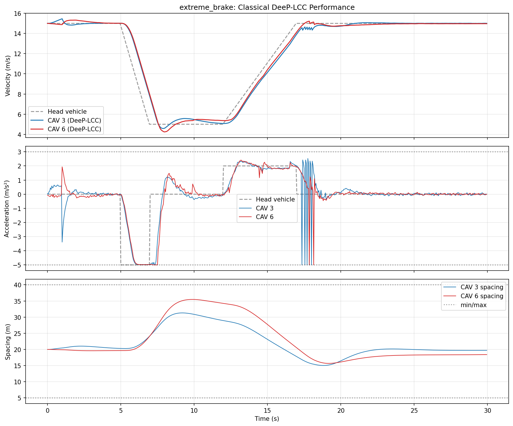
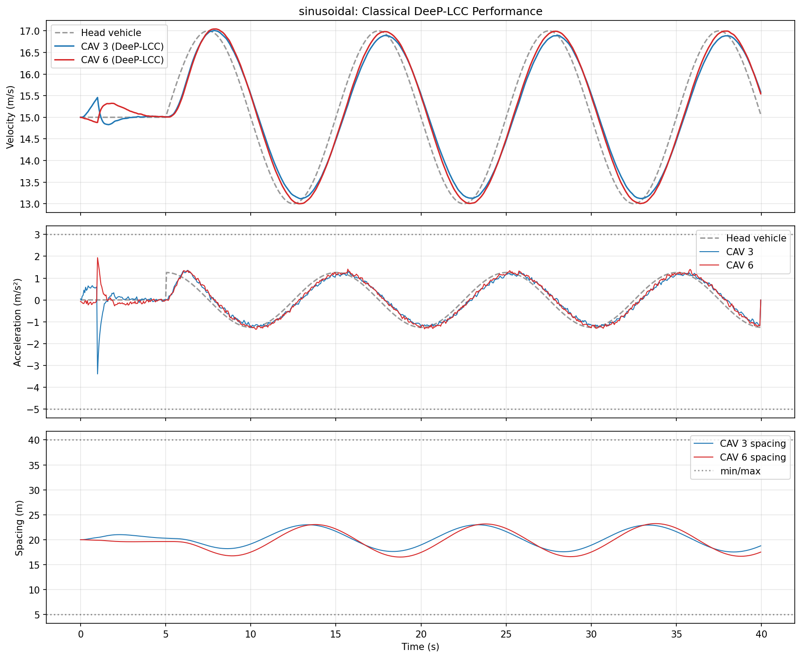
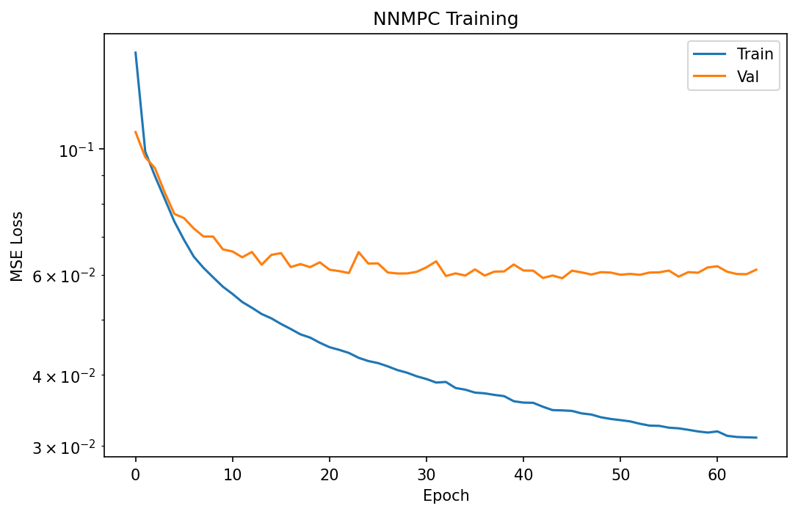
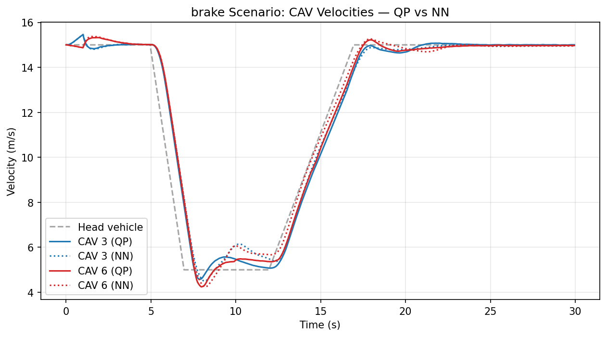
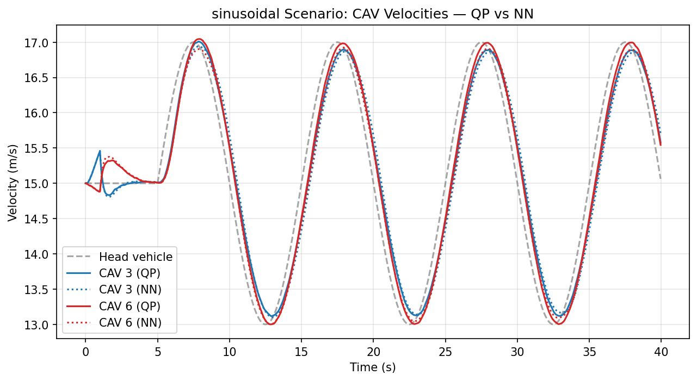
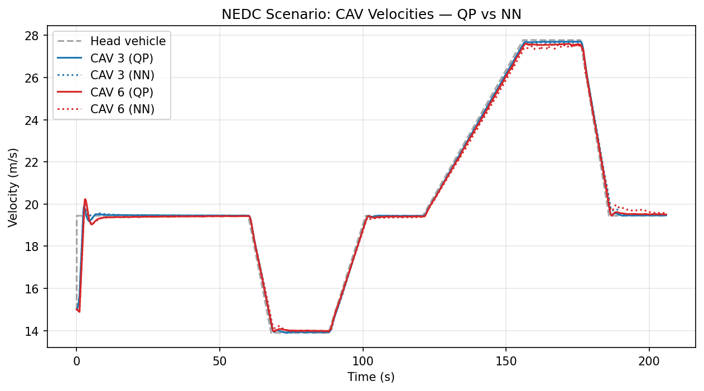

# DeeP-LCC Dataset Generation

## Overview

This module generates (state, solution) pair datasets for training an NNMPC (Neural Network Model Predictive Control) surrogate of DeeP-LCC, following the architecture in [arxiv:2510.03354](https://arxiv.org/abs/2510.03354).

The pipeline runs entirely in Python using OVM (Optimal Velocity Model) car-following dynamics — no SUMO dependency. It ports the [MATLAB DeeP-LCC implementation](https://github.com/soc-ucsd/DeeP-LCC) to produce datasets that can train a neural network to approximate DeeP-LCC's QP solver in real time.

## Background: DeeP-LCC

DeeP-LCC (Data-EnablEd Predictive Leading Cruise Control) is a data-driven predictive controller for connected autonomous vehicles (CAVs) in mixed traffic. Unlike model-based MPC, it uses pre-collected trajectory data organized into Hankel matrices to predict future system behavior without an explicit system model.

**Key reference:** Wang et al., "Data-Driven Predicted Control for Connected and Autonomous Vehicles in Mixed Traffic," IEEE Trans. Control Systems Technology, 2023.

### How It Works

1. **Pre-collection (offline):** Apply persistently exciting random inputs to the traffic system for `T` steps. Record control inputs `u`, external disturbances `e`, and measured outputs `y`. Build Hankel matrices from these trajectories.

2. **Online control:** At each time step, given the past `T_ini` steps of data `(uini, yini, eini)`, solve a QP to find optimal future control actions that minimize a cost function balancing velocity tracking, spacing regulation, and control effort.

3. **Receding horizon:** Only the first control action `u_opt[0]` is applied; then the process repeats.

### The Optimization Problem

$$
\min_{g} \quad \|Y_f g\|_Q^2 + \|U_f g\|_R^2 + \lambda_g \|g\|_2^2 + \lambda_y \|Y_p g - y_{\text{ini}}\|_2^2
$$

subject to:

$$
\begin{bmatrix} U_p \\ E_p \\ E_f \end{bmatrix} g = \begin{bmatrix} u_{\text{ini}} \\ e_{\text{ini}} \\ 0 \end{bmatrix}
$$

$$
a_{\min} \leq U_f g \leq a_{\max} \qquad \text{(acceleration bounds)}
$$

$$
s_{\min} - s^* \leq S_f Y_f g \leq s_{\max} - s^* \qquad \text{(spacing safety constraints)}
$$

where $g$ is the decision variable (Hankel combination weights), $U_f g$ and $Y_f g$ recover optimal future control and output trajectories, and $S_f$ selects the CAV spacing entries from the output vector.

### QP Solver: CachedDeepLCCSolver

The solver reformulates the paper's eq. (37) by substituting out $\sigma_y$, $u$, and $y$, reducing the problem to a single decision variable $g$ (1931 dimensions with default parameters). This matches the [reference Python implementation](https://github.com/soc-ucsd/DeeP-LCC/blob/main/Python%20Implementations/_fcn/qp_DeeP_LCC.py).

The `CachedDeepLCCSolver` splits the computation into a one-time setup and per-step solve:

- **`__init__` (once per episode):** pre-builds the constant matrices P (quadratic cost), A (equality constraints), G/h (inequality constraints) from the Hankel matrices. These depend only on the pre-collected data and cost weights.
- **`__call__` (every timestep, ~106ms):** updates only the linear cost vector `q` and equality RHS `b` (which depend on the current rolling window `uini, yini, eini`), then calls cvxopt's dense interior-point QP solver.

## Vehicle Configuration

Matches the DeeP-LCC reference implementation exactly:

- **8 following vehicles:** `ID = [0, 0, 1, 0, 0, 1, 0, 0]`
    - 6 HDVs (human-driven, follow OVM model)
    - 2 CAVs at positions 3 and 6 (controlled by DeeP-LCC)
- **1 head vehicle** with externally perturbed velocity
- Total: 9 vehicles in a platoon

### OVM Parameters (Heterogeneous, data_str=2)

Each HDV has distinct driver behavior parameters, matching the reference `hdv_ovm_2.mat`:

| HDV | α (alpha) | β (beta) | s_go (m) |
|-----|-----------|----------|----------|
| 1 | 0.45 | 0.60 | 38 |
| 2 | 0.75 | 0.95 | 31 |
| 3 (CAV) | 0.60 | 0.90 | 35 |
| 4 | 0.70 | 0.95 | 33 |
| 5 | 0.50 | 0.75 | 37 |
| 6 (CAV) | 0.60 | 0.90 | 35 |
| 7 | 0.40 | 0.80 | 39 |
| 8 | 0.80 | 1.00 | 34 |

Common parameters: `v_max = 30 m/s`, `s_st = 5 m`, `v* = 15 m/s`, `s* = 20 m`.

**OVM dynamics:**
```
V_d(s) = v_max/2 · (1 - cos(π · (s - s_st) / (s_go - s_st)))
a = α · (V_d(s) - v_follower) + β · (v_leader - v_follower)
```

Acceleration is saturated to `[-5, 3]` m/s² for CAVs (with extra headroom for velocity tracking) and `[-5, 2]` m/s² for HDVs. Safety braking (ADAS) is applied when deceleration demand exceeds the limit.

## DeeP-LCC Parameters

| Parameter | Value | Description |
|-----------|-------|-------------|
| T | 2000 | Pre-collection trajectory length |
| T_ini | 20 | Past data horizon |
| N | 50 | Prediction horizon |
| Tstep | 0.05 s | Simulation time step |
| weight_v | 5.0 | Velocity error weight (emphasizes tracking) |
| weight_s | 0.1 | Spacing error weight (reduced for tracking focus) |
| weight_u | 0.1 | Control effort weight |
| λ_g | 100 | Regularization on g |
| λ_y | 10,000 | Output consistency regularization |
| acel_max | 3.0 m/s² | Maximum CAV acceleration |
| dcel_max | -5.0 m/s² | Maximum deceleration |
| spacing_min | 5.0 m | Minimum safe spacing |
| spacing_max | 40.0 m | Maximum spacing |

### Perturbation Mixing

The head vehicle perturbation varies across episodes to cover the full operating range:

| Type | Amplitude | Fraction | Head velocity range | Purpose |
|------|-----------|----------|-------------------|---------|
| Random | ±1 m/s | 30% | [14, 16] m/s | Near-equilibrium behavior |
| Random | ±3 m/s | 15% | [12, 18] m/s | Moderate disturbances |
| Random | ±5 m/s | 10% | [10, 20] m/s | Aggressive disturbances |
| Brake | -5 m/s² | 25% | [5, 15] m/s | Emergency braking response |
| Sinusoidal | 5 m/s | 10% | [10, 20] m/s | Periodic tracking |
| Sinusoidal | 3 m/s | 10% | [12, 18] m/s | Moderate periodic tracking |

NEDC scenario is excluded from training data because disabling AEB is not safe at high velocities (14-28 m/s).

### Measurement Type

Uses `measure_type = 3`: velocity errors of all 8 vehicles + spacing errors of 2 CAVs only.

Output vector dimension: `p = n_vehicle + n_cav = 8 + 2 = 10`.

## Dataset Format

Saved as `.npz` with the following arrays:

| Key | Shape | Description |
|-----|-------|-------------|
| `uini` | `(N_samples, 40)` | Past CAV accelerations (2 CAVs × 20 steps) |
| `yini` | `(N_samples, 200)` | Past output measurements (10 outputs × 20 steps) |
| `eini` | `(N_samples, 20)` | Past head vehicle velocity disturbance |
| `u_opt` | `(N_samples, 2)` | Optimal first control action (receding horizon) |
| `metadata` | `(6,)` | `[v_star, s_star, T_ini, N, lambda_g, lambda_y]` |

The NN input is `(uini, yini, eini)` concatenated (260 features); the label is `u_opt` (2 values).

## Pipeline Architecture

All three scripts (dataset generation, classical evaluation, NN evaluation) share a single simulation function `run_with_state()` in `eval_classical.py`. This ensures the training data is generated in exactly the same environment used for evaluation.

```
┌─────────────────────────────────────────────────────────────┐
│                   For each episode:                         │
│                                                             │
│  Phase 1: Pre-Collection (precollect.py)                    │
│  ┌───────────────────────────────────────────┐              │
│  │ OVM simulation with random PE inputs      │              │
│  │ for T=2000 steps                          │              │
│  │  → Build Hankel matrices                  │              │
│  │    (Up, Uf, Ep, Ef, Yp, Yf)              │              │
│  └───────────────────────────────────────────┘              │
│                        ↓                                    │
│  Phase 2: Closed-Loop DeeP-LCC (run_with_state)             │
│  ┌───────────────────────────────────────────┐              │
│  │ OVM simulation with QP controller         │              │
│  │  → At each step:                          │              │
│  │    1. HDV dynamics + noise                │              │
│  │    2. Measure output (y_k, e_k)           │              │
│  │    3. Update equilibrium (v_star)          │              │
│  │    4. Build state: (uini, yini, eini)     │              │
│  │    5. Solve QP → u_opt                    │              │
│  │    6. Record (state, u_opt) pair          │              │
│  │    7. Apply u_opt to CAVs                 │              │
│  │    8. Integrate dynamics                  │              │
│  └───────────────────────────────────────────┘              │
│                        ↓                                    │
│  Save dataset.npz                                           │
└─────────────────────────────────────────────────────────────┘
```

## Usage

### Dataset Generation

```bash
# Generate dataset (100 episodes × 100s, ~5.5 hours)
uv run rl_mixed_traffic/deep_lcc/generate_dataset.py

# Output: deep_lcc_dataset/dataset.npz (~198k samples)
```

### NNMPC Training

```bash
uv run rl_mixed_traffic/deep_lcc/nnmpc_train.py

# Output: deep_lcc_results/nnmpc.pth, deep_lcc_results/nnmpc_training_loss.png
```

### Classical DeeP-LCC Evaluation

```bash
uv run rl_mixed_traffic/deep_lcc/eval_classical.py

# Evaluates QP on brake, sinusoidal, and NEDC scenarios
# Output: deep_lcc_results/classical_*.png
```

### NNMPC Evaluation (NN vs QP)

```bash
uv run rl_mixed_traffic/deep_lcc/nnmpc_eval.py

# Compares NN and QP on brake, sinusoidal, and NEDC scenarios
# Output: deep_lcc_results/*_cav_velocities.png
```

## Classical DeeP-LCC Results

The classical QP controller was validated against the reference implementation from [soc-ucsd/DeeP-LCC](https://github.com/soc-ucsd/DeeP-LCC). Key fixes to match the paper: heterogeneous HDV parameters, correct regularization values (λ_g=100, λ_y=10,000), dynamic equilibrium update, and reference-matching brake amplitude.

### Brake Scenario

Head vehicle: 5s settle → brake at -5 m/s² for 2s (15→5 m/s) → 5s coast → +2 m/s² for 5s → cruise. Both CAVs track the head vehicle with smooth deceleration and recovery. Spacing stays within [5, 40] m bounds.



### Sinusoidal Scenario

Head vehicle: 5s settle → 2 m/s amplitude sine wave, period 10s. CAVs track the oscillation with ~0.5s phase lag. Acceleration follows the sinusoidal pattern without hitting constraint bounds.



## NNMPC Architecture

The NNMPC approximates the DeeP-LCC QP solver with a simple MLP:

```
Input (260) → Linear(256) → ReLU → Linear(128) → ReLU → Linear(2) → Tanh → Scale to [-5, 3]
```

- **Input:** concatenated `(uini, yini, eini)` = 40 + 200 + 20 = 260 features
- **Output:** 2 CAV accelerations, bounded by Tanh + asymmetric scaling to [dcel_max, acel_max]
- **Parameters:** ~100k
- **Input normalization:** per-feature mean/std from training set, saved with checkpoint

### Training

- Supervised learning: MSE loss on `u_opt` predictions
- Adam optimizer (lr=5e-4, weight_decay=1e-5)
- Early stopping on validation loss (patience=20 epochs)
- Train/val split: 90/10
- Best-validation checkpoint saved (not final epoch)



The training curve shows some overfitting (train/val gap widens after epoch 10), but the deployed model uses the best-validation checkpoint (~epoch 10).

## NNMPC Closed-Loop Results

### Brake Scenario — NN vs QP

The NN (dotted) closely tracks the QP (solid) through the entire brake-coast-recover cycle with no divergence or compounding error.



### Sinusoidal Scenario — NN vs QP

The NN reproduces the QP's sinusoidal tracking with matching amplitude and phase across all 4 cycles.



### NEDC Scenario — NN vs QP (Generalization Test)

NEDC was **not** in the training data. Despite this, the NN generalizes successfully to the full 206s NEDC cycle spanning 14-28 m/s — a velocity range and profile shape never seen during training.



### Performance Summary

| Scenario | In Training? | NN vs QP | Divergence? |
|----------|-------------|----------|-------------|
| Brake (15→5→15 m/s) | Yes | Near-identical | No |
| Sinusoidal (±2 m/s, 10s period) | Yes | Near-identical | No |
| NEDC (14-28 m/s, 206s) | **No** | Near-identical | No |

The NNMPC achieves comparable performance to the classical DeeP-LCC QP solver with ~100x faster inference (<1ms vs ~106ms per step).

## Key Lesson: Unified Simulation Loop

The most critical factor for NN performance was **ensuring the training and evaluation environments are identical**. Early experiments showed catastrophic NN divergence (velocities reaching 80+ m/s) despite reasonable offline MSE. The root cause was three separate simulation implementations with subtle differences in:

- Order of HDV dynamics vs measurement computation
- Rolling buffer management and indexing
- Head vehicle perturbation application timing

After unifying all scripts to use a single `run_with_state()` function, the NN's closed-loop performance improved from catastrophic divergence to near-perfect QP tracking — without changing the network architecture, training hyperparameters, or dataset size.

## Module Structure

```
rl_mixed_traffic/deep_lcc/
├── config.py            # OVMConfig + DeepLCCConfig dataclasses
├── ovm.py               # OVM car-following dynamics (heterogeneous support)
├── hankel.py            # Hankel matrix construction
├── measurement.py       # Output measurement function
├── qp_solver.py         # CachedDeepLCCSolver (cvxopt dense interior-point)
├── precollect.py        # Phase 1: trajectory pre-collection
├── eval_classical.py    # Classical QP evaluation + shared run_with_state()
├── generate_dataset.py  # Dataset generation (uses run_with_state)
├── nnmpc_config.py      # NNMPC training configuration
├── nnmpc_network.py     # NNMPC neural network (MLP)
├── nnmpc_train.py       # Supervised training script
└── nnmpc_eval.py        # NN vs QP closed-loop evaluation (uses run_with_state)
```

## Model Mismatch: OVM vs SUMO IDM

The dataset is generated using **OVM** dynamics, but the SUMO ring road uses **IDM** (`carFollowModel="IDM"` in `configs/ring/circle.rou.xml`). This creates a sim-to-sim gap when deploying the NNMPC surrogate in SUMO.

**Impact on RL integration ([arxiv:2510.03354](https://arxiv.org/abs/2510.03354)):**

The RLMPC (residual correction) architecture is designed to handle imperfect base controllers: RL generates additive corrections `δu` on top of NNMPC output `u_nn`, giving `u = u_nn + δu`. The RL explicitly learns to compensate for NNMPC errors, including model mismatch between OVM and IDM.
