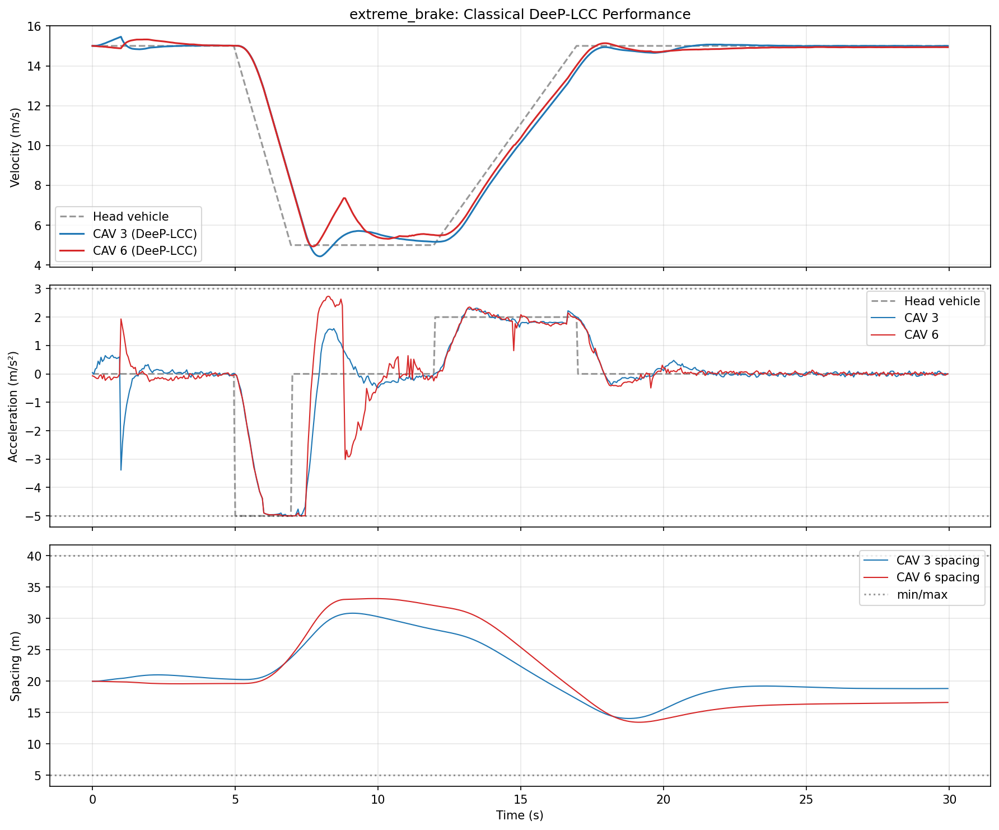
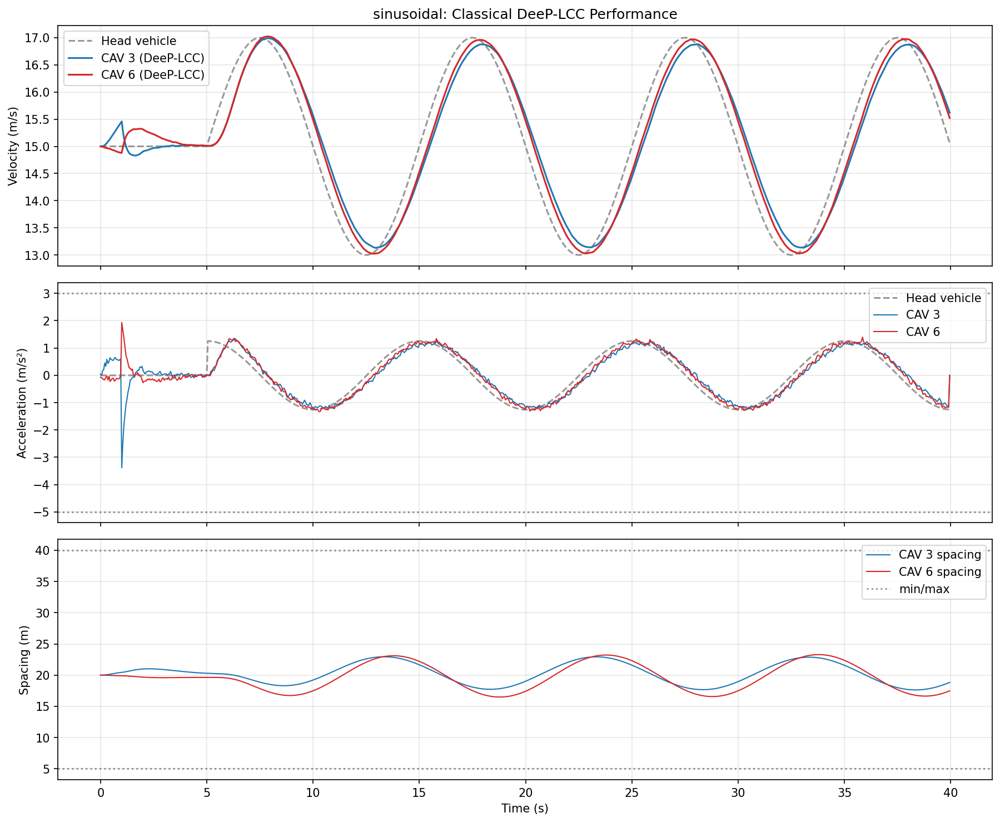
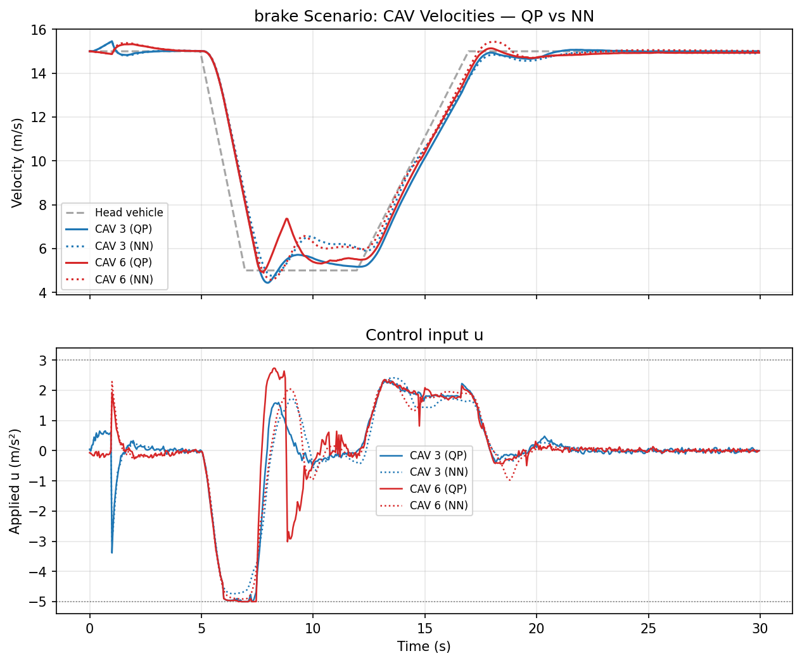
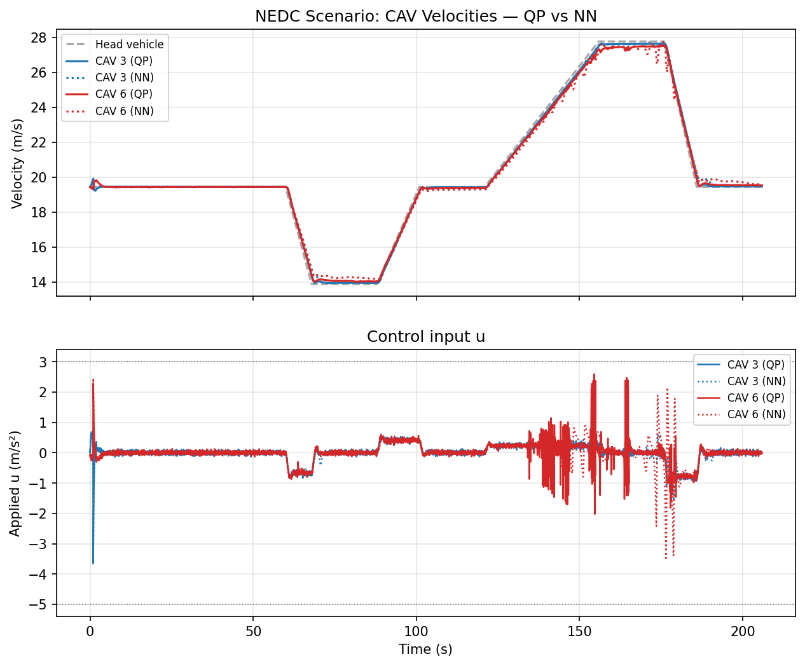

# DeeP-LCC & NNMPC Development Progress

## April 9, 2026 — Initial Investigation & Codebase Analysis

### Classical DeeP-LCC
- Reviewed the full `deep_lcc/` pipeline: precollect → QP solver → dataset generation → NNMPC training → evaluation
- Analyzed how the QP solver (`CachedDeepLCCSolver`) reformulates the paper's eq. (37) by substituting out `σ_y`, `u`, `y` to solve for `g` alone
- Confirmed the solver matches the reference implementation at [soc-ucsd/DeeP-LCC](https://github.com/soc-ucsd/DeeP-LCC)

### NNMPC (Before Fixes)
- Ran initial NN evaluation — NN diverged catastrophically on all scenarios (velocity going to 80+ m/s)
- Root cause identified: **compounding error** from distribution shift — NN errors push state out of training distribution, Tanh saturates at `+2 m/s²`, velocity increases unboundedly

### Key Insights
- The NN loses all structural guarantees from the QP (trajectory consistency, spacing constraints, optimality, multi-step planning) in exchange for ~100x inference speedup
- The receding horizon structure in DeeP-LCC provides feedback, constraint enforcement, and robustness to model mismatch — none of which the NN can replicate structurally

---

## April 9–10, 2026 — Matching the Reference Paper

### Parameter Fixes (comparing against arXiv:2203.10639)
Found 6 parameter mismatches between our code and the paper:

| Parameter | Old | New (paper) | Impact |
|-----------|-----|-------------|--------|
| `s_go` | 25 | **35** | OVM dynamics, equilibrium spacing |
| `lambda_g` | 1.0 | **100** | QP regularization |
| `lambda_y` | 1e3 | **1e4** | Past output matching penalty |
| Simulation duration | 40s | **206s** (NEDC) | Scenario timescale |
| HDV parameters | Homogeneous | **Heterogeneous** | Wave propagation dynamics |
| Equilibrium update | Fixed | **Dynamic** | Adapts to time-varying conditions |

### NEDC Validation
- Obtained reference simulation data (`.mat` file from soc-ucsd lab)
- Implemented dynamic equilibrium update: `v_star = mean(head_vel over T_ini)`, `s_star` via OVM spacing policy
- **Result**: QP velocity profiles closely match the reference over the full 206s NEDC cycle

---

## April 10, 2026 — Classical Evaluation & Bug Fixes

### Created `eval_classical.py`
- Standalone script evaluating classical DeeP-LCC on brake, sinusoidal, and NEDC scenarios
- 3-panel plots: velocity tracking, acceleration (with head vehicle), spacing (with constraint lines)
- Performance metrics: total cost, MSVE, fuel consumption (Bowyer 1985 model)

### Simulation Loop Bug Fix
- Found an **off-by-one bug** in `uini` construction: the QP received the HDV-computed acceleration for the current step instead of the QP's own output from the previous step
- This caused oscillating (bang-bang) control as the QP tried to correct for inconsistent past data
- **Fix**: lagged indexing `u[:, k-T_ini : k]` (past T_ini steps NOT including current step)

---

## April 14, 2026 — Heterogeneous HDVs & Scenario Refinement

### Heterogeneous OVM Parameters
Added per-vehicle (α, β, s_go) from the reference `hdv_ovm_2.mat`, with each HDV having distinct driver behavior parameters. CAV positions (3 and 6) use nominal values.

### Brake Scenario Fixes
- **Brake amplitude**: changed from full stop (15→0 m/s) to reference's partial stop (15→5 m/s)
- **Fixed `s_star=20`**: matching the reference which does not update spacing dynamically in the brake scenario
- **Added 5s settle phase**: lets QP reach steady state before perturbation
- **Result**: cost dropped from 111,886 to 23,187 (4.8x improvement)

### Classical DeeP-LCC Results

**Brake Scenario** — CAVs track the head vehicle through 15→5→15 m/s with smooth deceleration and recovery. Spacing stays within [5, 40] m bounds.



**Sinusoidal Scenario** — CAVs track the 2 m/s amplitude sine wave with ~0.5s phase lag. Acceleration follows the sinusoidal pattern without hitting constraint bounds. Spacing oscillates mildly (17-23 m) around equilibrium.



---

## April 15, 2026 — Weight Tuning & Acceleration Constraints

### Cost Weight Tuning
Ran a sweep of `weight_v` values [1, 2, 3, 5] to balance velocity tracking against control smoothness:
- Higher `weight_v` → better MSVE but more constraint saturation and AEB events
- `weight_v=3` identified as sweet spot (MSVE 1.29, saturation 12.6%)
- Final config uses `weight_v=5, weight_s=0.1` to emphasize velocity tracking for the NN task

### Acceleration Constraint
- With `acel_max=2`, the QP saturates at the constraint bound during recovery (head accelerates at +2, CAV can't go faster to close the gap)
- **Changed `acel_max=3`**: gives the CAV +1 m/s² headroom to catch up, eliminates saturation
- Verified safe without AEB on brake/sinusoidal scenarios (min spacing stays well above 5 m)

### Dataset Generation Config
```python
weight_v = 5.0    # velocity tracking emphasis
weight_s = 0.1    # reduced spacing penalty
weight_u = 0.1    # control effort
acel_max = 3.0    # CAV acceleration headroom
lambda_g = 100.0
lambda_y = 1e4
total_time = 100.0  # per episode
```
- 100 episodes with mixed perturbations (random ±1/±3/±5, brake, sinusoidal)
- No AEB during data collection (clean QP labels)
- NEDC excluded from training data (AEB required for safety at high speeds)

---

## April 16, 2026 — Unified Simulation Loop (Critical Fix)

### The Problem
The NN evaluation showed completely different QP behavior from the classical eval — the QP velocity profiles didn't match between scripts. Root cause: **three separate simulation implementations** (dataset generator, classical eval, NN eval) with subtle differences in:
- Order of HDV dynamics vs measurement computation
- Rolling buffer management and indexing
- Head vehicle perturbation application timing

These caused the NN to receive numerically different `(uini, yini, eini)` inputs at eval than it saw during training, triggering distribution shift and compounding error.

### The Fix
Refactored all three scripts to share a single simulation function `run_with_state()`:

| Script | Purpose | How it uses `run_with_state` |
|--------|---------|------------------------------|
| `generate_dataset.py` | Training data | `controller_fn=None` (QP), `collect_dataset=True` |
| `eval_classical.py` | Classical QP eval | `controller_fn=None` (QP) |
| `nnmpc_eval.py` | NN vs QP comparison | `controller_fn=nn_controller` vs `None` |

### The Result
The unified simulation loop was the single most impactful change. With training and evaluation using identical simulation code, the NN's closed-loop performance improved from catastrophic divergence to near-perfect QP tracking.

---

## Final Results

### NNMPC Training
The NN (260→256→128→2 MLP with Tanh output scaling) was trained via supervised learning on ~198k QP-generated samples. The training curve shows some overfitting (train/val gap widens after epoch 10), but the deployed model uses the best-validation checkpoint.


### Closed-Loop Evaluation: NN vs QP

**Brake Scenario** — The NN (dotted) closely tracks the QP (solid) through the entire brake-coast-recover cycle. Both CAVs follow the head vehicle with minimal divergence. No compounding error.



**Sinusoidal Scenario** — The NN reproduces the QP's sinusoidal tracking with matching amplitude and phase. The dotted NN lines overlay the solid QP lines throughout all 4 cycles.


**NEDC Scenario (Generalization Test)** — NEDC was NOT in the training data. Despite this, the NN generalizes successfully to the full 206s NEDC cycle spanning 14-28 m/s — a velocity range and profile shape never seen during training. The NN overlays the QP almost perfectly.



### Summary

| Scenario | In Training? | NN vs QP | Divergence? |
|----------|-------------|----------|-------------|
| Brake (15→5→15 m/s) | Yes | Near-identical | No |
| Sinusoidal (±2 m/s, 10s period) | Yes | Near-identical | No |
| NEDC (14-28 m/s, 206s) | **No** | Near-identical | No |

The NNMPC achieves comparable performance to the classical DeeP-LCC QP solver with ~100x faster inference (<1ms vs ~106ms per step), enabling real-time deployment.

### Key Takeaway
The most critical factor for NN performance was not the network architecture, training hyperparameters, or dataset size — it was **ensuring the training and evaluation environments are identical**. The unified simulation loop eliminated distribution shift between training and inference, which was the root cause of all prior divergence failures.
