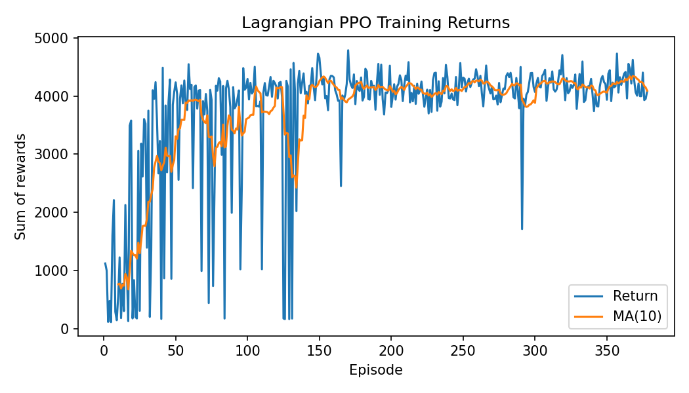
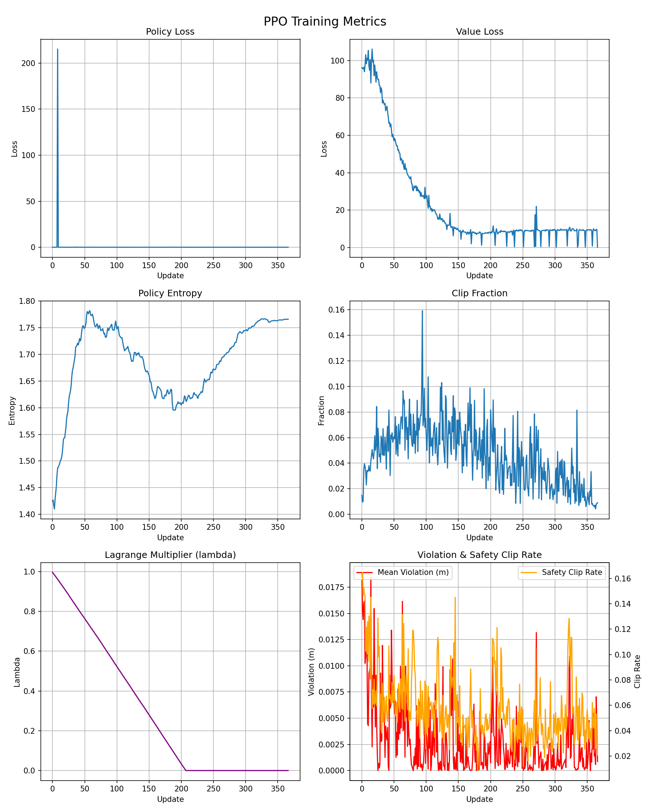
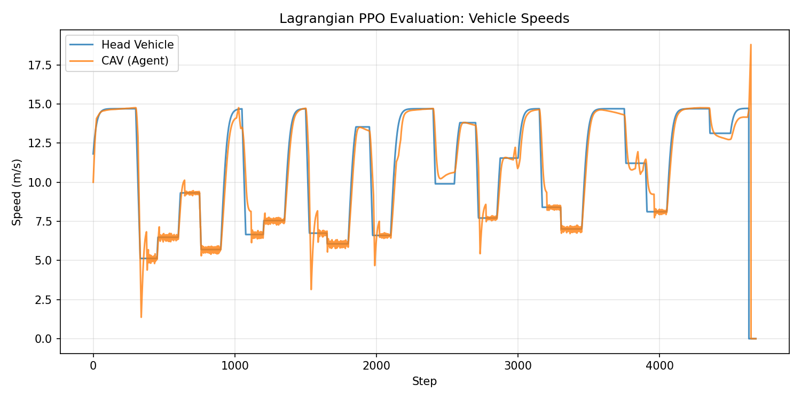
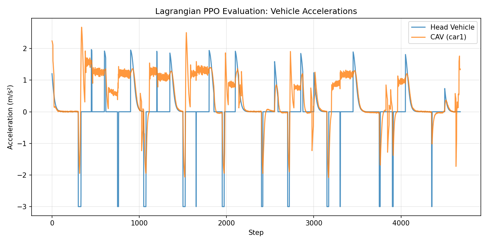
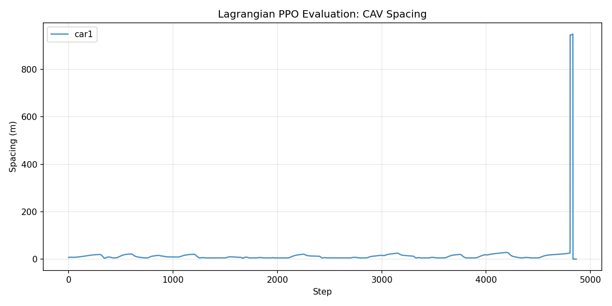

# Lagrangian PPO: Safety-Constrained Training

This page documents the Lagrangian PPO variant — an attempt to solve the SUMO safety override problem by disabling SUMO's built-in safety checks and replacing them with a learned + hard-constraint approach.

## 1. Motivation

Standard PPO training relies on SUMO's speed mode 95, which keeps the Krauss car-following model active. As documented in [Reward Redesign](reward-redesign.md), this causes SUMO to silently override 99.1% of agent commands — the agent learns a degenerate "always accelerate" policy because SUMO handles all braking.

The idea behind Lagrangian PPO: **disable SUMO safety entirely** (speed mode 0) and have the agent learn safe behavior through two mechanisms:

1. **Hard constraint** — a physics-based safety layer that clips unsafe accelerations before they reach SUMO.
2. **Soft penalty** — a Lagrange multiplier that penalizes spacing violations in the reward signal.

The PPO algorithm itself is unchanged. Only the environment wrapper and reward augmentation differ.

## 2. Safety Layer

The safety layer (`rl_mixed_traffic/env/safety_layer.py`) is a pure-math filter with no SUMO dependency. It uses a one-step constant-acceleration prediction to check whether a requested acceleration would violate the minimum spacing threshold.

### Physics model

Predicted spacing after one timestep:

$$
\hat{s} = s + v_\text{rel} \cdot \Delta t - \tfrac{1}{2} a \cdot \Delta t^2
$$

where $s$ is the current bumper-to-bumper gap, $v_\text{rel} = v_\text{leader} - v_\text{ego}$ (negative means closing), and $a$ is the requested acceleration.

### Clipping rule

If $\hat{s} < s_\text{min}$, compute the maximum safe acceleration that keeps the predicted spacing exactly at the threshold:

$$
a_\text{safe} = \frac{2(s - s_\text{min} + v_\text{rel} \cdot \Delta t)}{\Delta t^2}
$$

The filtered acceleration is:

$$
a_\text{filtered} = \min(a,\; a_\text{safe})
$$

The filter only restricts — it never allows a more aggressive acceleration than the agent requested.

### Parameters

| Parameter | Value | Description |
| --------- | ----- | ----------- |
| $s_\text{min}$ | 5.0 m | Minimum allowed bumper-to-bumper gap |
| $\Delta t$ | 0.1 s | Simulation timestep |

## 3. Lagrangian Reward Augmentation

The Lagrangian mechanism adds a soft spacing penalty to the base reward, with an adaptive multiplier that grows when violations occur.

### Constraint violation

At each step, the environment computes the spacing violation for each agent vehicle (`ring_env.py:335`):

$$
c_t = \max(s_\text{min} - s_t,\; 0)
$$

This is zero when the gap $s_t$ exceeds the threshold, and positive when the agent is too close to the leader.

### Augmented reward

The PPO agent sees an augmented reward instead of the base reward:

$$
r_\text{aug} = r_\text{base} - \lambda \cdot c_t
$$

The base reward is unchanged — the Lagrange multiplier $\lambda$ only adds an additional penalty proportional to the violation magnitude.

### Lambda update

At the end of each rollout (2048 steps), the multiplier is updated based on the mean violation across the rollout:

$$
\lambda \leftarrow \text{clip}\!\left(\lambda + \alpha_\lambda \cdot \bar{c},\; 0,\; \lambda_\text{max}\right)
$$

where $\bar{c}$ is the mean violation over the rollout. Lambda starts at 0 and grows only when violations occur. The clip keeps it bounded.

### Parameters

| Parameter | Config key | Default | Description |
| --------- | ---------- | ------- | ----------- |
| $\lambda_0$ | `lambda_init` | 0.0 | Initial multiplier value |
| $\alpha_\lambda$ | `lambda_lr` | 0.01 | Multiplier learning rate |
| $\lambda_\text{max}$ | `lambda_max` | 10.0 | Upper bound on multiplier |
| $s_\text{min}$ | `spacing_min` | 5.0 m | Minimum spacing threshold |

## 4. Training Configuration

### Standard PPO vs Lagrangian PPO

| Setting | Standard PPO | Lagrangian PPO |
| ------- | ------------ | -------------- |
| Total steps | 800,000 | 1,500,000 |
| Rollout steps | 4,096 | 4,096 |
| Learning rate | 3e-4 | 3e-4 |
| Clip epsilon | 0.15 | 0.15 |
| PPO epochs | 6 | 6 |
| Value function clipping | No | Yes (`vf_clip_coef=0.2`) |
| SUMO speed mode | 95 (safety on) | 0 (safety off) |
| Safety layer | No | Yes |
| Lagrangian penalty | No | Yes |
| `weight_v` / `weight_s` / `weight_u` | 1.0 / 0.5 / 0.2 | 5.0 / 0.5 / 0.1 |

The Lagrangian variant uses stronger velocity tracking (`weight_v=5`) and lower control penalty (`weight_u=0.1`) to reduce catch-up lag when the head vehicle changes speed. Value function clipping stabilizes the critic during longer training runs.

### 4.1 Reward smoothing: time-averaged v_eq

The DeeP-LCC reward penalizes velocity deviation from an equilibrium speed $v_\text{eq}$. Initially, $v_\text{eq}$ was the head vehicle's instantaneous speed — but the head changes speed every 15 seconds, causing sudden reward spikes that prevented convergence.

The fix: $v_\text{eq}$ is now a **20-second rolling average** of the head vehicle's speed. This smooths over speed transitions and gives the agent a learnable, gradually shifting target. The desired spacing $s^*$ is fixed at 20 m (no longer dynamic).

See the [Exploration Log, Section 4](exploration/lagrangian_ppo_reward_tuning.md#4-fix-applied--smoothed-v_eq--fixed-s_star) for implementation details and before/after comparisons.

### Config file

Source: `rl_mixed_traffic/conf/lagrangian_ppo_train.yaml`

Key environment and agent flags that differ from standard PPO:

```yaml
env:
  enable_safety_layer: true
  disable_sumo_safety: true
  spacing_min: 5.0
  weight_v: 5.0               # stronger velocity tracking
  weight_s: 0.5
  weight_u: 0.1               # less control penalty

agent:
  clip_vloss: true
  vf_clip_coef: 0.2
  enable_lagrangian: true
  lambda_init: 0.0
  lambda_lr: 0.01
  lambda_max: 10.0
```

### Running

```bash
uv run rl_mixed_traffic/lagrangian_ppo_train.py
```

Output goes to `lagrangian_ppo_results/`. The training loop tracks three additional metrics beyond standard PPO: `lambda` (current multiplier value), `mean_violation` (average spacing violation per rollout), and `safety_clip_rate` (fraction of steps where the safety layer clipped the action).

## 5. Results

### Post-fix results

After applying the smoothed $v_\text{eq}$ fix and reward weight rebalancing, the agent achieves functional car-following with no crashes.

| Metric | Result |
| ------ | ------ |
| Speed tracking | CAV follows head within 1-3 m/s across speed transitions (5-15 m/s range) |
| Acceleration | Smooth, modulated (0 to +1.5 m/s²), clear response to speed changes |
| Spacing | Stable 5-20 m for entire episode (~4700 steps), near $s^* = 20\;\text{m}$ |
| Returns | MA(10) rises to ~3500 by episode 80, plateaus at 3000-3800 |
| Entropy | Healthy explore-then-exploit curve (1.65 peak, settles to 1.50) |
| Crashes | **None** — full-episode car-following achieved |
| Lambda | Stays at 0 (see [Why lambda never engages](exploration/lagrangian_ppo_reward_tuning.md#6-why-the-lagrangian-multiplier-never-engages)) |

### Training curves



*Episode returns are bimodal early in training — the agent either follows successfully (~3500+) or loses the head vehicle and accumulates low reward (~200-1000). By episode 50 the MA(10) stabilizes in the 3000-3800 range. The persistent variance (drops to ~700 around episodes 100-120) reflects the stochastic head vehicle speed profile: some random speed sequences are inherently harder to track. Returns do not collapse, confirming the non-negative reward structure prevents the crash-to-escape incentive.*



*Top-left: Policy loss stays small (0-0.01) with occasional spikes — stable optimization. Top-right: Value loss starts high (~30) and decreases to ~10 but shows noisy oscillations in later updates, motivating the addition of value function clipping. Middle-left: Entropy peaks at ~1.6 around update 75, then declines to ~1.4 — a healthy explore-then-exploit trajectory. Middle-right: Clip fraction rises steadily from 0.02 to 0.12, indicating the policy is making larger updates as it improves. Bottom-left: Lambda stays at effectively zero for the entire run — the safety layer prevents violations from exceeding the tolerance (see Section 6 of the [exploration log](exploration/lagrangian_ppo_reward_tuning.md#6-why-the-lagrangian-multiplier-never-engages)). Bottom-right: Mean spacing violation (red) hovers at 0.02-0.04 m, well below the 5 m threshold; safety clip rate (yellow) fluctuates at 2-6%, confirming the safety layer intervenes infrequently.*

### Evaluation



*The CAV (orange) tracks the head vehicle (blue) through ~15 random speed transitions over the full episode (~4800 steps). Tracking is tightest in steady-state regions (e.g., steps 1000-1200 at ~7.5 m/s). Catch-up lag of 2-3 seconds is visible after sharp head speed increases — the CAV overshoots slightly before settling, a consequence of the 20 s v_eq averaging window smoothing the target. The agent handles both upward and downward transitions. The drop to 0 m/s at step ~4700 is the head vehicle exiting the simulation at episode end.*



*The head vehicle (blue) applies instantaneous speed changes via `setSpeed()`, producing sharp acceleration spikes (up to +2 m/s² and -3 m/s²). The CAV (orange) responds with smooth, modulated acceleration in the 0 to +1.5 m/s² range. Negative CAV accelerations (braking) are rare and gentle, showing the positive acceleration bias noted in the results table. The CAV's acceleration profile is continuous and jerk-limited — a direct result of the $u^2$ control penalty in the DeeP-LCC reward discouraging abrupt changes.*



*Bumper-to-bumper gap stays in the 5-25 m range for the entire episode (steps 0-4500), well above the 5 m safety threshold. Small oscillations (5-20 m) correlate with head speed transitions — the gap briefly widens when the head accelerates and the CAV catches up. The spike to ~950 m at step ~4700 is an artifact: the head vehicle is removed from the simulation at episode end, and the gap measurement wraps around the ring circumference. No spacing violations occur during normal operation.*

### Remaining behaviors

- **Catch-up lag (~2-3 s):** After head speed changes, the CAV takes a few seconds to match. The 20 s averaging window inherently delays $v_\text{eq}$. Increased `weight_v` (5.0) reduces but does not eliminate this.
- **Slight positive acceleration bias:** The agent accelerates more than it brakes. The $u^2$ penalty is symmetric, but positive acceleration is more useful for catching up.
- **Value loss instability:** Critic loss rises in later updates. Value function clipping (`clip_vloss=true`) mitigates this.

### Pre-fix results (historical)

Before the smoothed $v_\text{eq}$ fix, the agent collided under speed mode 0. The root cause was the **negative-only reward structure** combined with instantaneous $v_\text{eq}$ causing reward whiplash. With rewards always $\leq 0$, the agent was incentivized to crash early (terminating the episode escapes accumulated negative reward).

This insight led to the reward redesign documented in [Reward Redesign](reward-redesign.md) and detailed in the [Exploration Log](exploration/lagrangian_ppo_reward_tuning.md).
