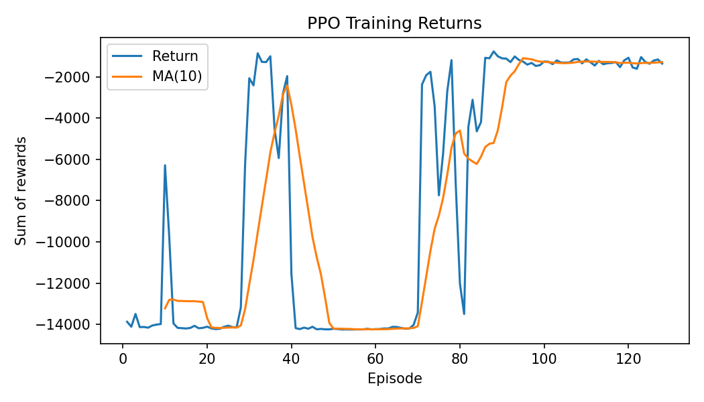
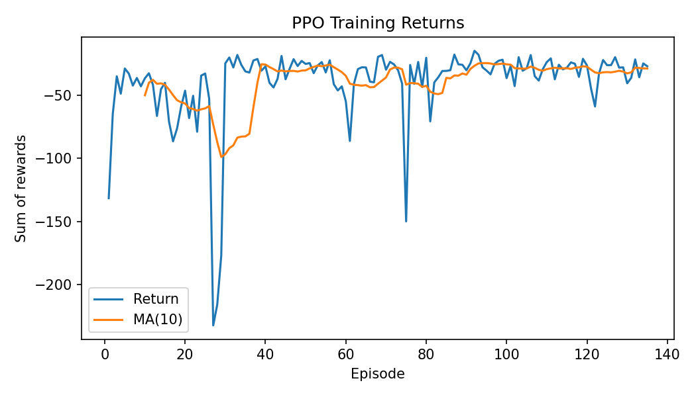
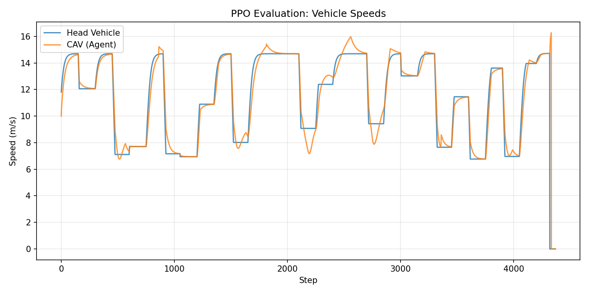
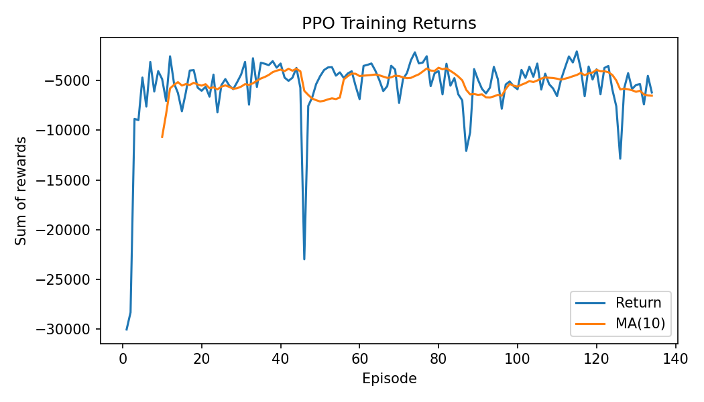

# PPO Refactoring: From CleanRL-Style to Stable Training

This page documents the refactoring of the PPO implementation, the problems encountered, and the lessons learned about continuous action spaces in traffic control environments.

## Motivation

The original PPO implementation used **tanh-squashed Gaussian policies** with manual action scaling and a hardcoded reward divisor (`R /= 100`). While functional, the code had several issues:

- Tanh squashing required a manual Jacobian correction for log-probabilities
- Action scaling from $[-1, 1]$ to $[-3, 3]$ was done outside the environment
- The reward divisor was a magic constant with no adaptive behavior

The goal was to modernize the PPO code following [CleanRL](https://github.com/vwxyzjn/cleanrl) conventions, which have been shown to improve training stability and reproducibility across standard benchmarks (MuJoCo, Atari, etc.).

## The CleanRL-Style Refactoring

The refactoring applied the following changes:

### Changes Made

| Component | Before | After (CleanRL) |
| --- | --- | --- |
| **Action output** | `tanh(sample)`, manual scale to $[-3, 3]$ | Raw Gaussian sample, `ClipAction` wrapper |
| **Log-probability** | Gaussian log-prob with Jacobian correction | Plain Gaussian log-prob |
| **Hidden activations** | ReLU | tanh |
| **Weight initialization** | PyTorch defaults | Orthogonal init (std=$\sqrt{2}$ for shared, 0.01 for actor, 1.0 for critic) |
| **Log-std clamping** | Clamped to $[-2.0, 0.5]$ | Unclamped |
| **Reward handling** | `R /= 100` hardcoded | `NormalizeReward` + `TransformReward(clip to [-10, 10])` wrappers |
| **Step API** | 4-tuple `(obs, reward, done, info)` | 5-tuple via `FourToFiveTupleWrapper` |

### Wrapper Chain

The refactored environment applies a chain of Gymnasium wrappers:

```
RingRoadEnv -> FourToFiveTupleWrapper -> ClipAction -> NormalizeReward -> TransformReward
```

- **FourToFiveTupleWrapper**: Bridges the 4-tuple `step()` API to Gymnasium's 5-tuple `(obs, reward, terminated, truncated, info)` without modifying the base environment.
- **ClipAction**: Clips actions to the environment's action space bounds $[-3, 3]$.
- **NormalizeReward**: Divides rewards by a running standard deviation for adaptive scaling.
- **TransformReward**: Clips normalized rewards to $[-10, 10]$ to prevent outliers.

## Results: Unstable Training

The refactored version showed significantly worse training stability compared to the original.

### Training Returns Comparison

**Original (tanh squashing):**



**CleanRL-style (raw Gaussian + ClipAction):**

The training curve showed frequent collapses throughout the entire run. Episodes that had been stable would suddenly drop to returns 5-10x worse, and the moving average never fully stabilized.

### Vehicle Speed Tracking

**Original:**


**CleanRL-style:**

The CAV exhibited large speed overshoots (5-6 m/s above the head vehicle) and oscillatory tracking behavior, indicating the learned policy was applying overly aggressive accelerations.

## Root Cause Analysis

The instability was traced to a **feedback loop** between the raw Gaussian policy and the `NormalizeReward` wrapper:

1. **Raw Gaussian outputs extreme actions.** Without tanh's natural bounding, the policy can produce acceleration values that swing abruptly between the full $-3$ and $+3$ m/s$^2$ range. The `ClipAction` wrapper hard-clips these, but provides **zero gradient** for out-of-bound outputs — the network cannot learn *how far* it overshot.

2. **Extreme actions cause collisions.** Abrupt acceleration changes lead to unsafe following distances, triggering the $-100$ safety penalty in the reward function.

3. **Safety penalties destabilize `NormalizeReward`.** The large penalty shifts the running reward statistics, distorting the reward scale for subsequent episodes.

4. **Distorted rewards cause bad policy updates.** The value function estimates become inaccurate, leading to poor advantage estimates and further policy degradation.

This cycle did not occur with tanh squashing because **tanh naturally prevents extreme actions**. The sigmoid-like shape means the network needs exponentially larger pre-activation values to push actions closer to the boundary, acting as an implicit regularizer.

### Why CleanRL Conventions Didn't Transfer

CleanRL's raw Gaussian approach works well for environments like MuJoCo (HalfCheetah, Hopper, etc.) because:

- **Smooth dynamics**: Physics simulators have continuous, differentiable dynamics. An extreme action produces a proportionally bad outcome, not a discontinuous penalty.
- **No hard safety penalties**: MuJoCo rewards are typically smooth quadratic costs. There is no equivalent of the $-100$ collision penalty that can destabilize reward normalization.
- **Dense reward signal**: Every step provides informative gradient information. In the ring road environment, the reward signal is sparser and dominated by the safety constraint.

The ring road environment has a **discontinuous reward landscape** (the $-100$ safety penalty creates a cliff) that interacts poorly with reward normalization when the policy can produce extreme actions.

## Final Implementation: Hybrid Approach

The final implementation keeps the beneficial CleanRL changes while restoring tanh squashing:

### What Was Kept from CleanRL

- **Orthogonal weight initialization** with appropriate scales (std=$\sqrt{2}$ for shared layers, 0.01 for actor, 1.0 for critic)
- **tanh hidden activations** instead of ReLU in shared layers
- **`NormalizeReward` + `TransformReward` wrappers** for adaptive reward scaling
- **`FourToFiveTupleWrapper`** for Gymnasium 5-tuple API compatibility

### What Was Reverted

- **tanh action squashing** restored — actions are squashed to $[-1, 1]$ then scaled by `max_accel`
- **Jacobian correction** for log-probabilities restored:

$$
\log \pi(a \mid s) = \log \mu(u \mid s) - \sum_i \log(1 - \tanh^2(u_i))
$$

- **Log-std clamping** to $[-2.0, 0.5]$ restored to prevent exploration from becoming too large or too small

### Action Scaling

The tanh output $a_{\tanh} \in [-1, 1]$ is scaled to the acceleration range using simple multiplication:

```python
action_scaled = action_tanh * max_accel  # [-1, 1] * 3.0 -> [-3, 3]
```

This works because the action space is symmetric. The `ClipAction` wrapper remains in the chain as an additional safety net.

## Results: Stable Training (with NormalizeReward)

### Training Returns



The training curve converges by episode ~85 and remains stable, with only rare dips. The MA(10) shows consistent improvement without the periodic collapses seen in the CleanRL-style version.

### Training Metrics


- **Policy loss**: Near zero with isolated spikes that recover quickly.
- **Value loss**: Drops from 0.25 to near 0, stable after update 100.
- **Entropy**: Healthy fluctuation around 1.5 — the policy maintains exploration without collapsing.

### Vehicle Speed Tracking



The CAV tracks the head vehicle closely with minor overshoots (~1-2 m/s), comparable to the original implementation.

## Removing NormalizeReward

While restoring tanh squashing fixed the instability, the `NormalizeReward` wrapper introduced its own issues. The reward function already applies `R /= 100` to keep per-step values in a PPO-friendly range, making adaptive normalization redundant and even harmful:

1. **Non-stationary reward scale.** `NormalizeReward` uses a running standard deviation that shifts during training. The same raw reward maps to different normalized values at episode 10 vs episode 100, confusing the value function.

2. **Uninterpretable returns.** Training returns become meaningless across runs. The normalized returns (~-25) cannot be compared to the raw returns (~-1,500) from other configurations, making it hard to evaluate whether a hyperparameter change actually improved performance.

3. **Collision penalty interaction.** Early episodes with $-100$ safety penalties inflate the running standard deviation. This makes the fine-grained velocity and spacing reward signals appear tiny by comparison, effectively flattening the reward landscape for the policy.

Since the reward function is fixed and its scale is known, the `R /= 100` divisor already keeps rewards in a good range in a stationary way — no running statistics needed.

The `NormalizeReward` and `TransformReward` wrappers were removed, leaving a minimal wrapper chain:

```
RingRoadEnv -> FourToFiveTupleWrapper -> ClipAction
```

### Results: Without NormalizeReward

#### Training Returns



| Version | Converged Return | Stabilizes at | Collapse Episodes |
| --- | --- | --- | --- |
| **Original baseline** | ~-1,500 | Episode ~95 | 40-70 (long plateau) |
| **With NormalizeReward** | ~-25 (normalized) | Episode ~85 | 30, 75 |
| **Without NormalizeReward** | ~-5,000 | Episode ~10 | Rare dips at 45, 85 |

Training converges **much faster** (MA(10) reaches steady state by episode ~10 vs ~85-95) and the returns are now raw values directly comparable across runs. The converged value of ~-5,000 reflects the larger raw reward scale from the orthogonal init + tanh activation changes compared to the original baseline.

#### Training Metrics


- **Value loss**: Starts high (~10,000) due to the larger raw return scale, then drops quickly and stabilizes after update ~50.
- **Policy loss**: Some spikes around updates 100-250, but generally small. More active than the NormalizeReward version since the reward signal is no longer dampened.
- **Entropy**: Clear downward trend from ~1.50 to ~1.30 — the policy is becoming more deterministic as it learns, which is healthy behavior.

#### Vehicle Speed Tracking


The CAV tracks the head vehicle well during steady-state phases. There is some overshoot on upward speed transitions (~2-3 m/s above the head vehicle at steps 150 and 4300), slightly more than the original baseline but comparable to the NormalizeReward version. This is likely improvable with hyperparameter tuning (lower learning rate and fewer epochs per update).

## Key Takeaways

1. **Environment characteristics matter more than "best practices."** CleanRL conventions are well-tested on standard benchmarks but don't automatically transfer to environments with discontinuous reward functions and hard safety constraints.

2. **Tanh squashing provides implicit regularization.** Beyond bounding actions, tanh's saturating gradient naturally discourages extreme outputs. This is critical in environments where extreme actions have catastrophic consequences (collisions).

3. **Reward normalization is unnecessary when the reward scale is known.** `NormalizeReward` is designed for environments where the reward magnitude is unknown or varies. When the reward function is fixed and already scaled (via `R /= 100`), adaptive normalization adds non-stationarity without benefit.

4. **Hybrid approaches can capture the best of both worlds.** Orthogonal initialization and tanh activations from CleanRL improved training, while the original tanh squashing and log-std clamping provided the stability needed for this specific environment.

## Hyperparameter Tuning

PPO hyperparameters can be overridden via Hydra on the command line:

```bash
uv run -m rl_mixed_traffic.ppo_train agent.lr=1e-4 agent.k_epochs=6 total_steps=800000
```

Key parameters to tune for this environment:

| Parameter | Default | Effect |
| --- | --- | --- |
| `agent.lr` | 3e-4 | Lower (1e-4) for smoother policy updates |
| `agent.k_epochs` | 10 | Lower (4-6) to prevent overfitting per rollout |
| `agent.clip_epsilon` | 0.2 | Lower (0.1-0.15) for tighter trust region |
| `rollout_steps` | 2048 | Higher (4096) for more stable advantage estimates |
| `agent.batch_size` | 64 | Higher (128-256) to reduce gradient noise |
| `total_steps` | 600,000 | Higher (800k-1M) for more training time |
